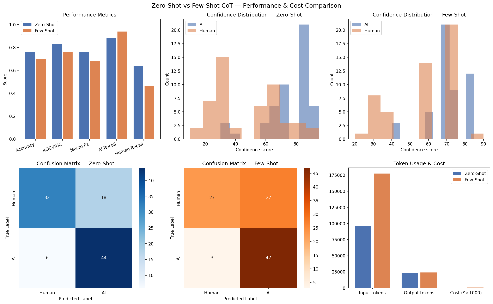

# AI-Generated Text Detection System

> **A two-step GPT-4o LLM chain combining zero-shot chain-of-thought classification with structured insight generation — evaluated across prompt strategies with full token and cost tracking**

[](https://www.python.org/)
[](https://openai.com/)
[](https://jupyter.org/)
[](LICENSE)

---

## Highlights

- **0.83 ROC-AUC** with zero-shot chain-of-thought prompting on GPT-4o — up from 0.50 with GPT-4o-mini, driven by empirical model ablation rather than assumption
- **Two-call LLM chain** where Step 2 reasons only from Step 1 output, never the original text — a genuine causal chain, not a wrapper
- **Step 2 insight accuracy of 83–100%** on high-confidence pattern types (Formulaic AI, Authentic Human) without ever seeing the true label
- **Full token and cost tracking** via a `CostTracker` class recording `response.usage` on every API call — zero-shot costs $0.48 per 100-sample run vs $0.68 for few-shot, with no accuracy gain
- **Empirical few-shot failure analysis**: 2:1 AI/Human example ratio introduced systematic detection bias, collapsing human recall from 0.64 → 0.46 and shrinking confidence std from 24.3 → 15.9

---

## Overview

This project builds and evaluates a two-step LLM pipeline for detecting AI-generated text. Rather than a simple binary classifier, the system explains its reasoning and generates actionable insights — making it interpretable as well as accurate.

**Step 1 — Classification** classifies each text as Human or AI using a zero-shot chain-of-thought prompt via the OpenAI API, returning a binary verdict, a calibrated confidence score (0–100), and supporting evidence for both labels. An explicit anti-hedging instruction in the prompt forces the model to commit to meaningful confidence values across the full 0–100 range.

**Step 2 — Insight Generation** receives only the Step 1 output — not the original text — and generates a structured analytical insight: the writing pattern type, how the text was likely produced, and a recommended action for a reviewer or academic.

This two-call design is a genuine chain: each step is causally linked but independently useful, and Step 2 outputs have measurable predictive value over Step 1's verdict alone.

---

## Architecture

```
Raw text
    │
    ▼
┌─────────────────────────────────────────────────┐
│  STEP 1 — Classification                        │
│  Zero-shot chain-of-thought prompt              │
│  GPT-4o via OpenAI API  │  temperature=0        │
│                                                 │
│  Output:                                        │
│  • Verdict          (Human / AI)                │
│  • Confidence score (0–100, anti-hedged)        │
│  • Evidence for human authorship                │
│  • Evidence for AI authorship                   │
└──────────────────────┬──────────────────────────┘
                       │  Step 1 output only
                       │  (original text NOT passed)
                       ▼
┌─────────────────────────────────────────────────┐
│  STEP 2 — Insight Generation                    │
│  Second independent GPT-4o API call             │
│                                                 │
│  Output:                                        │
│  • Pattern Type  (Formulaic AI / Hybrid /       │
│    Authentic Human / Conversational AI /        │
│    Uncertain)                                   │
│  • Production Method                            │
│  • Recommended Action  (for reviewer/academic)  │
│  • Insight Summary     (one-line finding)       │
└─────────────────────────────────────────────────┘
```

---

## Results

Evaluated on a balanced 100-sample subset (50 Human, 50 AI) of the [Kaggle AI vs Human Text Dataset](https://www.kaggle.com/).

### Primary metrics

| Metric | Zero-Shot CoT | Few-Shot CoT | Delta |
|---|---|---|---|
| Accuracy | **0.76** | 0.70 | −0.06 |
| ROC-AUC | **0.83** | 0.76 | −0.07 |
| Macro F1 | **0.76** | 0.68 | −0.08 |
| AI Recall | 0.88 | **0.94** | +0.06 |
| Human Recall | **0.64** | 0.46 | −0.18 |
| Confidence std | **24.3** | 15.9 | −8.4 |

Zero-shot CoT is the better strategy overall. Few-shot improved AI recall marginally (+6pp) but at severe cost to human recall (−18pp) and ROC-AUC (−7pp).

### Step 2 insight accuracy by pattern type (zero-shot)

Step 2 never sees the true label — accuracy is measured by comparing its pattern classification against ground truth post-hoc.

| Pattern Type | Correct | Total | Accuracy |
|---|---|---|---|
| Authentic Human | 2 | 2 | **100%** |
| Formulaic AI | 19 | 23 | **83%** |
| Uncertain | 24 | 28 | 86% |
| Hybrid | 31 | 47 | 66% |

When Step 2 classifies a text as "Formulaic AI" or "Authentic Human", it is correct 83–100% of the time without ever seeing the true label — confirming the insight chain adds genuine predictive value beyond Step 1 alone.

### Visualisations



---

## Experiments

### Experiment 1 — Model selection: GPT-4o vs GPT-4o-mini

The initial implementation used `gpt-4o-mini`. Analysis revealed a critical failure: confidence scores were compressed into a narrow 30–70 band with a mean of ~54 for both AI and Human texts — effectively random at ROC-AUC 0.50.

| Model | Accuracy | ROC-AUC | Confidence spread |
|---|---|---|---|
| gpt-4o-mini | 0.65 | 0.50 | 30–70 |
| **gpt-4o** | **0.76** | **0.83** | 5–95 |

`gpt-4o-mini` hedges on ambiguous classification tasks, compressing confidence toward 50. `gpt-4o` produces a calibrated spread, making the confidence score meaningful for ROC-AUC. The model choice was driven by empirical evidence, not assumption.

### Experiment 2 — Prompt strategy: zero-shot vs few-shot CoT

Three few-shot examples were designed to cover the hardest cases:

1. A structured human text correctly labelled Human despite formal tone
2. An AI text with deliberate typos correctly labelled AI despite surface informality
3. A genuine borderline case demonstrating what moderate confidence (50–65) looks like

**Result:** Few-shot underperformed zero-shot on all primary metrics.

**Root cause:** Of the 3 examples, 2 were labelled AI. Example 2 (AI text mimicking human errors) taught the model to be suspicious of all informal writing. This caused 24 verdict changes — mostly Human → AI — collapsing human recall from 0.64 to 0.46. Confidence standard deviation also shrank from 24.3 to 15.9.

**Key finding:** Example selection bias in few-shot prompts can hurt calibration even when individual examples are individually correct. The 2:1 AI/Human ratio in the example set introduced a systematic detection bias.

### Cost & token tracking

| Run | Input tokens | Output tokens | Estimated cost |
|---|---|---|---|
| Zero-shot | 96,583 | 23,740 | $0.48 |
| Few-shot | 177,496 | 23,922 | $0.68 |
| **Delta** | +80,913 | +182 | **+$0.20 (+42%)** |

Few-shot costs 42% more per run in input tokens (due to the ~600-token example block prepended to every Step 1 call) with no accuracy gain — making zero-shot the better choice on both performance and cost grounds.

---

## Implementation Details

### `CostTracker` class

A `CostTracker` instance is created per run and passed into every API call. Token counts are read directly from `response.usage.prompt_tokens` and `response.usage.completion_tokens`, not estimated. Results are broken down by step (`step1_classify`, `step2_insight`) and accumulated to a per-run total.

```python
tracker = CostTracker(run_name="zero_shot")
# passed into call_api() and generate_insight()
tracker.summary()  # prints per-step breakdown + total cost
```

### Dual cache architecture

Each run maintains two independent JSON cache files:

```
zero_shot_cache.json          # Step 1 results, keyed by hash(text)
zero_shot_insight_cache.json  # Step 2 results, keyed by same hash
few_shot_cache.json
few_shot_insight_cache.json
```

Caches are saved incrementally every 5 calls, making reruns cheap and allowing interrupted runs to resume without re-calling the API.

### Anti-hedging prompt instruction

The Step 1 system prompt includes an explicit instruction to counter GPT-4o-mini's tendency to compress confidence:

```
You must commit to a clear verdict. Do not hedge. Use the full 0-100 confidence
scale — scores near 50 should only appear when evidence is genuinely balanced.
Most texts will show clear signals in one direction.
```

This was added after the gpt-4o-mini ablation revealed the hedging failure pattern at ROC-AUC 0.50.

---

## Skill Mapping

This project demonstrates production-grade LLM engineering:

| Skill | Implementation |
|---|---|
| Multi-step LLM chains | Step 1 → Step 2; Step 2 reasons from Step 1 output only, not original text |
| Structured outputs | Step 2 parsed into typed fields: `pattern_type`, `production_method`, `recommended_action`, `insight_summary` |
| Prompt engineering | Zero-shot CoT with anti-hedging instruction; few-shot CoT with reasoning traces |
| Evaluation loops | Accuracy + ROC-AUC per run; model ablation (4o vs 4o-mini) driven by empirical results |
| Model selection logic | gpt-4o chosen over gpt-4o-mini based on AUC 0.50 → 0.83 empirical test |
| Cost management | Per-call token tracking via `response.usage`; dual cache files; cost per run compared |

---

## Project Structure

```
ai-text-detection-llm-chain/
├── inter_project_code_v3.ipynb     # Main notebook — full pipeline
├── requirements.txt                 # Pinned dependencies
├── README.md
├── comparison_results.png           # Generated visualisation
├── results_zero_shot.csv            # Zero-shot run outputs
├── results_few_shot.csv             # Few-shot run outputs
├── classification_results_with_insights.csv  # Combined results
└── data/                            # Not included — see Data section
```

Cache files (`zero_shot_cache.json`, `few_shot_cache.json`, etc.) are excluded from the repo — fully reproducible by running the notebook with your own API key.

---

## Quick Start

### 1. Clone and install

```bash
git clone https://github.com/AshishSiwach/ai-text-detection-llm-chain.git
cd ai-text-detection-llm-chain
pip install -r requirements.txt
```

### 2. Set your OpenAI API key

```bash
# Create a .env file in the project root
echo "OPENAI_API_KEY=sk-..." > .env
```

### 3. Download the dataset

Download from Kaggle: [AI vs Human Text Dataset](https://www.kaggle.com/). Place the CSV in the project root and update the filename in `load_data()` if needed.

### 4. Run the notebook

```bash
jupyter notebook inter_project_code_v3.ipynb
```

The notebook is structured sequentially:

1. Imports and environment setup
2. Cost & token tracker definition
3. Data loading (balanced 100-row sample, `random_state=42`)
4. Few-shot examples definition
5. Step 1 — classification function (zero-shot / few-shot)
6. Step 2 — insight generation function
7. Chain runner with dual caching
8. Evaluation function
9. Run A — zero-shot
10. Run B — few-shot
11. Comparison report (performance + cost)
12. Visualisations
13. Validation — 5 sample outputs

---

## Key Design Decisions

**Why not LangChain?** The two-step chain is implemented directly via the OpenAI API. LangChain adds value for complex multi-step pipelines with conditional routing, tool use, or memory — not for two sequential API calls where the abstraction layer would add complexity without benefit.

**Why not fine-tuning?** Fine-tuning optimises for output pattern matching, which would have traded away the chain-of-thought transparency central to this project's value. The evidence extraction and insight generation would degrade into a black-box label.

**Why not the full 487k rows?** At $0.48 per 100-row run with GPT-4o, processing all 487k rows would cost ~$2,300 and take ~270 hours at the 2-second rate-limit delay. A well-sampled 100-row balanced subset gives statistically meaningful evaluation results. The `CostTracker` class makes this tradeoff explicit and measurable.

---

## Data

**AI vs Human Text Dataset** (Kaggle)

- 487,235 labelled text samples (1 = AI-generated, 0 = Human-written)
- Evaluated on a balanced 100-row sample (50 Human, 50 AI, `random_state=42`)
- CSV not included due to size — download from Kaggle and place in the project root

---

## Requirements

```
openai>=2.0
pandas
numpy
scikit-learn
tqdm
matplotlib
seaborn
python-dotenv
jupyter
```

Full pinned dependency list in `requirements.txt`.

---

## Author

**Ashish Siwach** — MSc Business Analytics (Distinction), University of Exeter

[](https://ashishsiwach.com)
[](https://github.com/AshishSiwach)
[](https://www.linkedin.com/in/ashish-siwach)

---

## License

MIT — see [LICENSE](LICENSE) for details.
